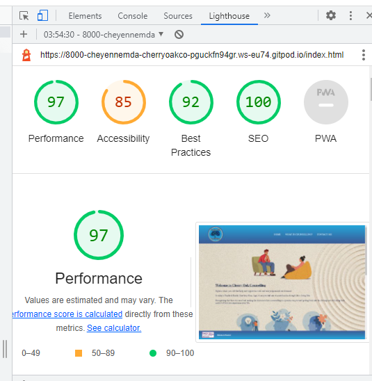
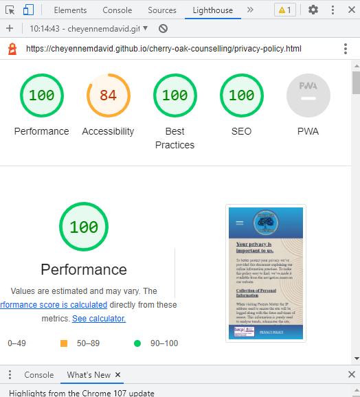

# Cherry Oak Counselling

Cherry Oak Counselling is a site that provides counselling services over a wide range of issues to people in the local area and also further afield via the internet, who need are in need of support.

## Features
### ~~~ Existing Features ~~~
#### Navigation
Featured on all four pages, the full responsive navigation bar includes links to the Logo, Home page, and explanation of what counselling is and the benefits of it, a Contact Form page and a Privacy Policy page.  Navigation is identical on each page to allow for easy navigation.

This section will allow the user to easily navigate from page to page across all devices without having to revert back to the previous page via the ‘back’ button.

### The Landing Page
The landing includes a picture with showing a man talking to his therapist,  The image is purposely graphic art.

The drawn image, whilst conveying sincerity, it is more neutral, which allows the site user to see the process taking place without feeling that the image is making assumptions on them and what they may or may not be coming to counselling for.

### Testimonials
As the landing page is scrolled, there is a short section with testimonials from people speaking of the benefits that have gained from using the service.

### Contacting Cherry Oak Counselling
Further scrolling the landing page and the user will find contact details along with a map in order to convery how easy it is to find the service if the the site user lives close.  If the site user prefers, there is a link to a contact form which is also accessable from the navigation bar.

### The Footer
In the footer, at the bottom of each page, there is a badge with a number.
This number would be an official number which shows that the therapist is accredited by BACP (British Association for Counselling and Psychotherapy)

  The Accreditation badge also has a link which will take the user to the BACP website directory where they will be able to check the credentials of the therapist.
 
 Also in in the footer is a link to the privacy policy.  Both the link to the BACP and the Privacy Policy are available from all pages via the footer.
 
  ### What is Counselling
 From the navigation, the user with find will be taken to a page giving a breif description of what counselling is and the benefits in an article qwritten by Emily Whitton and published on the website "The Counselling Directory", which can be found [HERE](https://www.counselling-directory.org.uk/what-is-counselling.html)

 ### Contact Form
 The  third button on the navigation will take the user to the contact form, where they can leave there details if that's their preference.  This form is also accessible via a link in the address and map area on the landing page.
 
 ### Features Left to Implement
 The Contact-Form requires attention.  its is happily responsive down to the resolutions of a Samsung Galaxy S9 and up to a resolution of 1920 x 1080.  But the japanese sand art background image doesn't work well with a tab S4.

 Also, aother future ideas

 # Testing
 ## Validator Testing
### CSS
~ No errors were returned when passing through the official [(Jigsaw) validator](https://jigsaw.w3.org/css-validator/#validate_by_input)

### HTML
~ No errors were found when passing through the official [W3C validator](https://validator.w3.org/#validate_by_input)

## Lighthouse Testing

~All pages did pass sucessfully~

Initially, lighthouse returned a poor level in Accessibility, with scores ranging between 84 - 87 across all the pages.  All other scores were green 100s, apart from one 92 and a 97.  Upon looking into it, the down mark for accessibility was due to an "input" not having a "label". The point being that a visually impared person wouldn't be aqble to utilise the input, if they didn't know what the input was for.  Which would be correct.

However, the input, which was in the form of a "checkbox" wasn't for use by a user.  It was being utilised as a toggle/switch in conjuction with media queries, resulting in the navigation switching between the classic horitontal bar and a drop-down menue.  I confirmed this to be the case, on all pages by removing the input and testing it before retuning it to it's function.  Absence of the input resulted in green 100s across everything in lighthouse and also the dropdown menus not working.  Having the input there in that capacity doesn't decrease accessibility.  It was only an issue to lighthouse's inability to take into account the nuance of the issue.

These are examples of how Lighthouse was incorrectly pulling them.  One in desktop and one in mobile.

## Unfixed Bugs
I'm unsure if this really qualifies, but I'm listing it here as it probably needs to be addressed.  When initially checking the pages for responsiveness, all pages passed, proving to be sturdy, well below the 340px width for a Galaxy S9.  And that is still the case.  However, since I started writing this document, I've since gone to send the site link and found that on a "real" galaxy S9, the image in the back ground breaks, despite DevTools not picking up the break until 262px width.

## Deployment
This section should describe the process you went through to deploy the project to a hosting platform (e.g. GitHub)

The site was deployed to GitHub pages. The steps to deploy are as follows:
In the GitHub repository, navigate to the Settings tab
From the source section drop-down menu, select the Master Branch
Once the master branch has been selected, the page will be automatically refreshed with a detailed ribbon display to indicate the successful deployment.

The live link can be found here: [Cherry-Oak-Counselling](https://cheyennemdavid.github.io/cherry-oak-counselling/?fbclid=IwAR1odokAJ5BO_o-Zh9DeOPImiPrQePJTmvqLT2fIYK7oPOp_uqZGN1WTQfU)  

## Credits

The code for the sticky, responsive header and navigation bar was written by a coder called Kevin Powell who has a channel on Youtube and I have borrowed it
from him.  The following are links, to the youtube video, where I followed his explanations: https://www.youtube.com/watch?v=8QKOaTYvYUA&t=172s.
This ia a link to his youtube channel: https://www.youtube.com/kepowob.
This is a link to his codepen profile where the code for this can be found: https://codepen.io/kevinpowell/pen/jxppmr
And this is his Github profile: https://github.com/kevin-powell

For the imbedded map section which got me round using a google API, I used learning and resources from "https://www.embedgooglemap.net/" and also "https://www.w3schools.com/howto/howto_css_responsive_iframes.asp"

And the content for the page "What is Counselling" was from an article published on The Counselling Directory and was written by: "Emily Whitton" and it can be found
[ here:](https://www.counselling-directory.org.uk/what-is-counselling.html).

The Logo for my site, I drew myself using a program called "Picsart"

The pictures are from istock, which I purchased

And the Privacy Policy is a real one that my wife had drawn up by a solicitor, but it never got used in the end.

