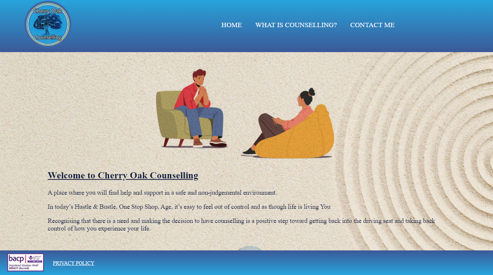
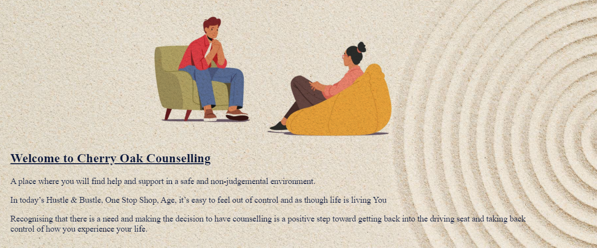
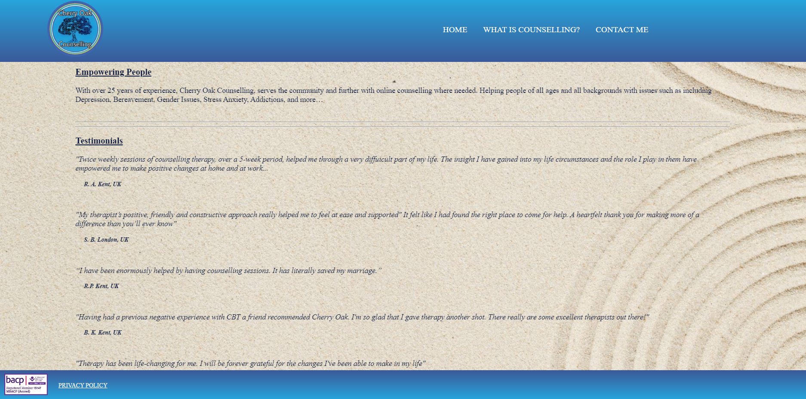
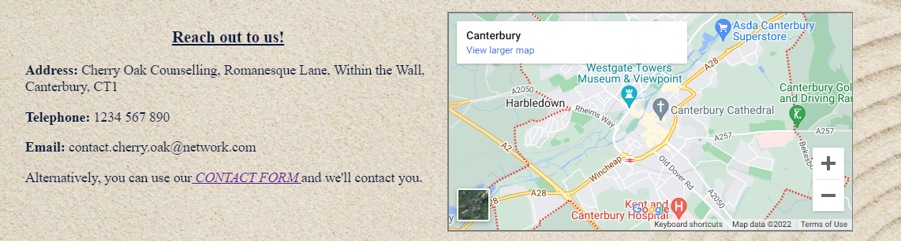

# Cherry Oak Counselling

Cherry Oak Counselling is a site that provides counselling services over a wide range of issues to people in the local area and also further afield via the internet, who need are in need of support.

## Features
### ~~~ Existing Features ~~~
#### Navigation
Featured on all four pages, the full responsive navigation bar includes links to the Logo, Home page, and explanation of what counselling is and the benefits of it, a Contact Form page and a Privacy Policy page.  Navigation is identical on each page to allow for easy navigation.

This section will allow the user to easily navigate from page to page across all devices without having to revert back to the previous page via the ‘back’ button.

### The Landing Page
The landing includes a picture with showing a man talking to his therapist,  The image is purposely graphic art.

The drawn image, whilst conveying sincerity, it is more neutral, which allows the site user to see the process taking place without feeling that the image is making assumptions on them and what they may or may not be coming to counselling for.

### Testimonials
As the landing page is scrolled, there is a short section with testimonials from people speaking of the benefits that have gained from using the service.

### Contacting Cherry Oak Counselling
Further scrolling the landing page and the user will find contact details along with a map in order to convery how easy it is to find the service if the the site user lives close.  If the site user prefers, there is a link to a contact form which is also accessable from the navigation bar.

### The Footer
In the footer, at the bottom of each page, there is a badge with a number.
This number would be an official number which shows that the therapist is accredited by BACP (British Association for Counselling and Psychotherapy)

  The Accreditation badge also has a link which will take the user to the BACP website directory where they will be able to check the credentials of the therapist.
 
 Also in in the footer is a link to the privacy policy.  Both the link to the BACP and the Privacy Policy are available from all pages via the footer.
 
  ### What is Counselling
 From the navigation, the user with find will be taken to a page giving a breif description of what counselling is and the benefits in an article qwritten by Emily Whitton and published on the website "The Counselling Directory", which can be found [HERE](https://www.counselling-directory.org.uk/what-is-counselling.html)

 ### Contact Form
 The  third button on the navigation will take the user to the contact form, where they can leave there details if that's their preference.  This form is also accessible via a link in the address and map area on the landing page.
 
 ### Features Left to Implement
 The Contact-Form requires attention.  its is happily responsive down to the resolutions of a Samsung Galaxy S9 and up to a resolution of 1920 x 1080.  But the japanese sand art background image doesn't work well with a tab S4.

 Also, another future ideasgit  

 # Testing
 ## Validator Testing
### CSS
~ No errors were returned when passing through the official [(Jigsaw) validator](https://jigsaw.w3.org/css-validator/#validate_by_input)

### HTML
~ No errors were found when passing through the official [W3C validator](https://validator.w3.org/#validate_by_input)

